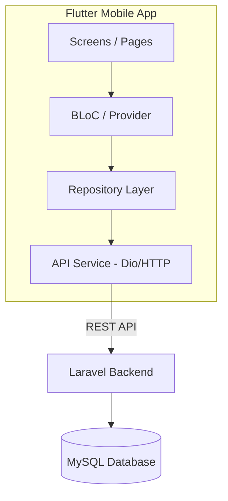

# Plan: Aplikasi Mobile Flutter PDAM — Role Pelanggan

Aplikasi mobile Flutter untuk pelanggan PDAM yang terhubung ke backend Laravel via REST API. Menggunakan **Flutter UI Kit open-source** sebagai fondasi desain (misalnya: [flutter_ui_kit by iampawan](https://github.com/iampawan/Flutter-UI-Kit) atau UI Kit serupa yang akan dikonfirmasi).

> [!IMPORTANT]
> **Konfirmasi diperlukan:** Nama "UI Kids" yang dimaksud — apakah ini merujuk ke template/UI Kit tertentu? Jika ya, mohon share link repository-nya agar bisa disesuaikan. Jika tidak, kita akan menggunakan Flutter UI Kit open-source populer sebagai fondasi.

---

## 1. Arsitektur Aplikasi



### Struktur Folder Flutter

```
lib/
├── main.dart
├── config/
│   ├── api_config.dart          # Base URL, endpoints
│   └── theme.dart               # Custom theme dari UI Kit
├── models/
│   ├── user.dart
│   ├── pelanggan.dart
│   ├── tagihan.dart
│   ├── pembayaran.dart
│   ├── pemakaian_air.dart
│   └── pengaduan.dart
├── services/
│   ├── api_service.dart         # HTTP client (Dio)
│   ├── auth_service.dart        # Login, logout, token
│   └── storage_service.dart     # SharedPreferences / SecureStorage
├── providers/
│   ├── auth_provider.dart
│   ├── dashboard_provider.dart
│   ├── tagihan_provider.dart
│   ├── pembayaran_provider.dart
│   └── pengaduan_provider.dart
├── screens/
│   ├── splash_screen.dart
│   ├── login_screen.dart
│   ├── dashboard_screen.dart
│   ├── tagihan/
│   │   ├── tagihan_list_screen.dart
│   │   └── tagihan_detail_screen.dart
│   ├── pembayaran/
│   │   ├── pembayaran_screen.dart
│   │   └── riwayat_pembayaran_screen.dart
│   ├── pengaduan/
│   │   ├── pengaduan_list_screen.dart
│   │   ├── pengaduan_create_screen.dart
│   │   └── pengaduan_detail_screen.dart
│   └── profile/
│       └── profile_screen.dart
├── widgets/
│   ├── custom_card.dart
│   ├── status_badge.dart
│   ├── bottom_nav.dart
│   └── loading_widget.dart
└── utils/
    ├── constants.dart
    ├── formatter.dart           # Rupiah formatter, date formatter
    └── validators.dart
```

---

## 2. Fitur Aplikasi (Khusus Pelanggan)

### 2.1 Splash Screen & Login
- Splash screen dengan logo PDAM
- Login menggunakan `username` + `password` (sesuai tabel `users`)
- Token disimpan di `flutter_secure_storage`
- Auto-login jika token masih valid

### 2.2 Dashboard
Data yang ditampilkan (mirror dari `DashboardController@pelanggan`):
- **Info Pelanggan**: nama, nomor pelanggan, alamat, golongan tarif
- **Tagihan Aktif**: tagihan dengan status `Belum Bayar` / `Pending` (1 terbaru)
- **Pemakaian Bulan Ini**: meter_awal, meter_akhir, total_pemakaian
- **Riwayat Pembayaran**: 3 pembayaran terakhir

### 2.3 Daftar Tagihan
- List semua tagihan pelanggan (paginated)
- Filter: Semua / Belum Bayar / Lunas
- Detail tagihan: periode, jumlah meter, biaya pemakaian, biaya admin, total

### 2.4 Pembayaran Online
- Pilih metode: Virtual Account (BNI, BRI, Mandiri) / QRIS
- Proses pembayaran → tampilkan kode bayar + batas waktu
- Status tracking: Pending → Sukses / Gagal

### 2.5 Riwayat Pembayaran
- List semua pembayaran (paginated)
- Detail: tanggal, jumlah, metode, status, kode pembayaran

### 2.6 Pengaduan
- List pengaduan yang pernah dikirim
- Buat pengaduan baru (kategori, judul, deskripsi)
- Detail pengaduan + tanggapan dari petugas
- Status badge: Baru → Diproses → Selesai

### 2.7 Profil
- Lihat data pelanggan (read-only dari data `pelanggan`)
- Ubah password

---

## 3. Daftar API yang Dibutuhkan (Backend Laravel)

> [!CAUTION]
> Saat ini backend **belum memiliki route `api.php`**. Semua route masih berbasis web (session auth). Perlu dibuat REST API baru dengan autentikasi **Laravel Sanctum** (token-based).

### 3.1 Authentication

| Method | Endpoint | Deskripsi | Request Body | Response |
|--------|----------|-----------|--------------|----------|
| `POST` | `/api/auth/login` | Login pelanggan | `{ username, password }` | `{ token, user, pelanggan }` |
| `POST` | `/api/auth/logout` | Logout / revoke token | — | `{ message }` |
| `GET` | `/api/auth/me` | Cek user & token validity | — | `{ user, pelanggan }` |

### 3.2 Dashboard

| Method | Endpoint | Deskripsi | Response |
|--------|----------|-----------|----------|
| `GET` | `/api/pelanggan/dashboard` | Data dashboard pelanggan | `{ pelanggan, tagihan_aktif, pemakaian_bulan_ini, riwayat_pembayaran[] }` |

### 3.3 Tagihan

| Method | Endpoint | Deskripsi | Query Params | Response |
|--------|----------|-----------|--------------|----------|
| `GET` | `/api/pelanggan/tagihan` | Daftar tagihan | `?status=Semua/Belum/Lunas&page=1` | `{ data[], pagination }` |
| `GET` | `/api/pelanggan/tagihan/{id}` | Detail tagihan | — | `{ tagihan, pemakaian_air, pembayaran }` |

### 3.4 Pembayaran

| Method | Endpoint | Deskripsi | Request Body | Response |
|--------|----------|-----------|--------------|----------|
| `POST` | `/api/pelanggan/bayar/{tagihan_id}` | Buat pembayaran online | `{ payment_method }` | `{ pembayaran, payment_code, amount, limit }` |
| `GET` | `/api/pelanggan/riwayat` | Riwayat pembayaran | `?page=1` | `{ data[], pagination }` |
| `GET` | `/api/pelanggan/pembayaran/{id}` | Detail pembayaran | — | `{ pembayaran, tagihan }` |

### 3.5 Pengaduan

| Method | Endpoint | Deskripsi | Request / Params | Response |
|--------|----------|-----------|------------------|----------|
| `GET` | `/api/pelanggan/pengaduan` | Daftar pengaduan | `?page=1` | `{ data[], pagination }` |
| `POST` | `/api/pelanggan/pengaduan` | Kirim pengaduan baru | `{ kategori, judul_pengaduan, deskripsi }` | `{ pengaduan }` |
| `GET` | `/api/pelanggan/pengaduan/{id}` | Detail pengaduan | — | `{ pengaduan }` |

### 3.6 Profil

| Method | Endpoint | Deskripsi | Request Body | Response |
|--------|----------|-----------|--------------|----------|
| `GET` | `/api/pelanggan/profil` | Data profil pelanggan | — | `{ user, pelanggan, golongan_tarif }` |
| `PUT` | `/api/pelanggan/profil/password` | Ubah password | `{ current_password, password, password_confirmation }` | `{ message }` |

---

## 4. Kebutuhan Backend (Perubahan Laravel)

### 4.1 Install & Setup Laravel Sanctum

```bash
composer require laravel/sanctum
php artisan vendor:publish --provider="Laravel\Sanctum\SanctumServiceProvider"
php artisan migrate
```

### 4.2 File yang Perlu Dibuat/Dimodifikasi

#### [NEW] `routes/api.php`
Route REST API untuk semua endpoint di atas, dilindungi middleware `auth:sanctum`.

#### [NEW] `app/Http/Controllers/Api/AuthController.php`
- `login()` — Validasi username + password, cek role `pelanggan`, generate token Sanctum
- `logout()` — Revoke current token
- `me()` — Return user + pelanggan data

#### [NEW] `app/Http/Controllers/Api/PelangganDashboardController.php`
- `index()` — Mirror logic dari `DashboardController@pelanggan`, return JSON

#### [NEW] `app/Http/Controllers/Api/PelangganTagihanController.php`
- `index()` — Daftar tagihan + filter + pagination, return JSON
- `show($id)` — Detail tagihan, return JSON

#### [NEW] `app/Http/Controllers/Api/PelangganPembayaranController.php`
- `bayar($tagihan_id)` — Mirror logic `PembayaranController@bayarOnline`, return JSON
- `riwayat()` — Mirror logic `PembayaranController@riwayat`, return JSON
- `show($id)` — Detail pembayaran, return JSON

#### [NEW] `app/Http/Controllers/Api/PelangganPengaduanController.php`
- `index()` — Daftar pengaduan pelanggan, return JSON
- `store(Request)` — Mirror logic `PengaduanController@store`, return JSON
- `show($id)` — Detail pengaduan, return JSON

#### [NEW] `app/Http/Controllers/Api/PelangganProfilController.php`
- `show()` — Data profil pelanggan + golongan tarif, return JSON
- `updatePassword(Request)` — Ubah password, return JSON

#### [MODIFY] `app/Models/User.php`
- Tambahkan trait `HasApiTokens` dari Sanctum

#### [MODIFY] `config/sanctum.php`
- Konfigurasi expiration time, dll.

---

## 5. Packages Flutter yang Dibutuhkan

| Package | Kegunaan |
|---------|----------|
| `dio` | HTTP client untuk API calls |
| `provider` | State management |
| `flutter_secure_storage` | Simpan token secara aman |
| `google_fonts` | Typography (Inter, Poppins) |
| `intl` | Format tanggal & mata uang |
| `shimmer` | Loading skeleton effect |
| `flutter_svg` | Icon SVG support |
| `pull_to_refresh` | Pull-to-refresh pada list |
| `cached_network_image` | Cache gambar dari network |
| `flutter_dotenv` | Environment variables |
| `go_router` | Navigasi / routing |

---

## 6. Tahapan Implementasi

### Phase 1: Backend API (Laravel)
1. Setup Sanctum & konfigurasi
2. Buat semua API Controller
3. Definisikan `routes/api.php`
4. Test semua endpoint dengan Postman / cURL

### Phase 2: Flutter Foundation
1. Init project Flutter
2. Setup struktur folder
3. Implementasi theme & design system (dari UI Kit)
4. Buat model classes (dart)
5. Buat API service layer (Dio + interceptors)
6. Implementasi auth flow (login, token storage, auto-login)

### Phase 3: Flutter Screens
1. Splash Screen & Login Screen
2. Dashboard Screen
3. Tagihan (list + detail)
4. Pembayaran Online (form + status)
5. Riwayat Pembayaran
6. Pengaduan (list + create + detail)
7. Profil & Ubah Password

### Phase 4: Polish
1. Error handling & offline state
2. Pull-to-refresh & loading states
3. Animasi & micro-interactions
4. Testing pada device/emulator

---

## 7. Data Model Mapping (Laravel → Dart)

### `User`
```dart
class User {
  final int id;
  final String name;
  final String username;
  final String role;
  final bool isActive;
}
```

### `Pelanggan`
```dart
class Pelanggan {
  final int id;
  final int userId;
  final String nomorPelanggan;
  final String nama;
  final String alamat;
  final String nomorMeter;
  final String? noTelepon;
  final int golonganTarifId;
  final String? fotoKtp;
  final String? koordinat;
  final bool isActive;
  final GolonganTarif? golonganTarif;
}
```

### `GolonganTarif`
```dart
class GolonganTarif {
  final int id;
  final String kodeGolongan;
  final String namaGolongan;
  final double tarifPerM3;
  final double biayaAdmin;
}
```

### `Tagihan`
```dart
class Tagihan {
  final int id;
  final int pelangganId;
  final int pemakaianAirId;
  final int periodeBulan;
  final int periodeTahun;
  final int jumlahMeter;
  final double biayaPemakaian;
  final double biayaAdmin;
  final double totalTagihan;
  final String? tanggalJatuhTempo;
  final String status;             // "Belum Bayar", "Pending", "Lunas"
  final PemakaianAir? pemakaianAir;
  final List<Pembayaran>? pembayaran;
}
```

### `PemakaianAir`
```dart
class PemakaianAir {
  final int id;
  final int pelangganId;
  final int periodeBulan;
  final int periodeTahun;
  final int meterAwal;
  final int meterAkhir;
  final int totalPemakaian;
}
```

### `Pembayaran`
```dart
class Pembayaran {
  final int id;
  final int tagihanId;
  final DateTime tanggalBayar;
  final double jumlahBayar;
  final String metodeBayar;       // "Loket", "Transfer Bank/QRIS"
  final String? penyediaLayanan;
  final String kodePembayaran;
  final String statusPembayaran;  // "Pending", "Sukses", "Gagal"
  final String? referensiGateway;
  final Tagihan? tagihan;
}
```

### `Pengaduan`
```dart
class Pengaduan {
  final int id;
  final int pelangganId;
  final String judulPengaduan;
  final String kategori;
  final String deskripsi;
  final DateTime tanggalPengaduan;
  final String status;            // "Baru", "Diproses", "Selesai"
  final String? tanggapan;
  final DateTime? tanggalTanggapan;
}
```

---

## 8. Verification Plan

### Automated Testing
```bash
# Backend API testing
php artisan test --filter=Api

# Flutter unit tests
flutter test
```

### Manual Verification
1. **Login flow** — Buka app → login dengan akun pelanggan → pastikan masuk dashboard
2. **Dashboard** — Verifikasi data tagihan aktif, pemakaian, dan riwayat muncul dengan benar
3. **Tagihan** — Cek daftar tagihan, filter, dan detail
4. **Pembayaran** — Test proses bayar online, verifikasi kode bayar muncul
5. **Pengaduan** — Buat pengaduan baru, cek muncul di list, lihat detail + tanggapan
6. **Profil** — Lihat data profil, test ubah password
