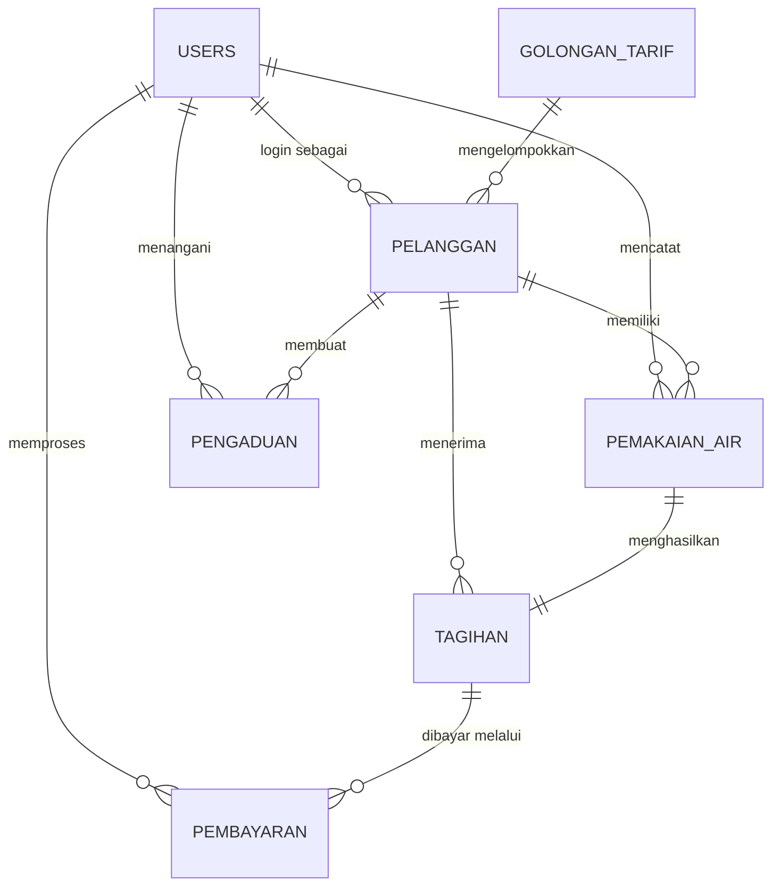

# Perancangan Basis Data (Database Plan)
## Sistem Informasi Pembayaran dan Pelayanan PDAM Berbasis Web

Berdasarkan spesifikasi kebutuhan fungsional (FR) dan Use Case dari dokumen `usecase_plan.md`, berikut adalah rancangan skema basis data yang dibutuhkan untuk mengakomodasi seluruh sistem.

---

## 1. Entity Relationship Diagram (ERD)

---

## 2. Struktur Tabel Basis Data

### 2.1. Tabel `users`
Menyimpan data otentikasi semua aktor (Admin, Petugas, Pelanggan, Pimpinan). Terkait dengan kebutuhan `FR-01`, `FR-03`, `FR-04`.

| Nama Kolom | Tipe Data | Keterangan | Aturan Tambahan |
|---|---|---|---|
| `id` | BIGINT | Primary Key | Auto Increment |
| `username` | VARCHAR(50) | Username login | UNIQUE, NOT NULL |
| `password` | VARCHAR(255) | Password (hashed/bcrypt) | NOT NULL |
| `name` | VARCHAR(100) | Nama lengkap pengguna | NOT NULL |
| `role` | ENUM | Peran akses pengguna | 'admin', 'petugas', 'pelanggan', 'pimpinan' |
| `is_active` | BOOLEAN | Status akun aktif/nonaktif | DEFAULT true |
| `created_at` | TIMESTAMP | Waktu record dibuat | |
| `updated_at` | TIMESTAMP | Waktu record diperbarui | |

### 2.2. Tabel `golongan_tarif`
Menyimpan klasifikasi referensi tarif air per meter kubik sesuai jenis pelanggan untuk `FR-05`, `FR-11`.

| Nama Kolom | Tipe Data | Keterangan | Aturan Tambahan |
|---|---|---|---|
| `id` | BIGINT | Primary Key | Auto Increment |
| `kode_golongan` | VARCHAR(20) | Kode golongan (ex: R1, R2, Niaga) | UNIQUE, NOT NULL |
| `nama_golongan` | VARCHAR(100) | Deskripsi nama golongan | NOT NULL |
| `tarif_per_m3` | DECIMAL(15,2) | Harga air per meter kubik | NOT NULL |
| `biaya_admin` | DECIMAL(15,2) | Biaya admin/pemeliharaan | DEFAULT 0 |
| `created_at` | TIMESTAMP | Waktu record dibuat | |
| `updated_at` | TIMESTAMP | Waktu record diperbarui | |

### 2.3. Tabel `pelanggan`
Menyimpan identitas detail pelanggan PDAM. Terkait `FR-05` sampai `FR-09`.

| Nama Kolom | Tipe Data | Keterangan | Aturan Tambahan |
|---|---|---|---|
| `id` | BIGINT | Primary Key | Auto Increment |
| `user_id` | BIGINT | Foreign Key ke tabel `users` | UNIQUE (opsional, u/ akses web pelanggan) |
| `nomor_pelanggan` | VARCHAR(50) | Nomor ID pelanggan PDAM | UNIQUE, NOT NULL |
| `nama` | VARCHAR(100) | Nama pelanggan | NOT NULL |
| `alamat` | TEXT | Alamat lengkap pelanggan | NOT NULL |
| `nomor_meter` | VARCHAR(50) | Nomor seri meteran | UNIQUE, NOT NULL |
| `no_telepon` | VARCHAR(20) | Nomor telepon/HP pelanggan | NULLABLE |
| `golongan_tarif_id`| BIGINT | Foreign Key ke `golongan_tarif` | NOT NULL |
| `is_active` | BOOLEAN | Status (Aktif / Nonaktif) | DEFAULT true |
| `created_at` | TIMESTAMP | Waktu record dibuat | |
| `updated_at` | TIMESTAMP | Waktu record diperbarui | |

### 2.4. Tabel `pemakaian_air`
Mencatat data volume meteran air pada periode tertentu. Terkait `FR-10`, `FR-12`.

| Nama Kolom | Tipe Data | Keterangan | Aturan Tambahan |
|---|---|---|---|
| `id` | BIGINT | Primary Key | Auto Increment |
| `pelanggan_id` | BIGINT | Foreign Key ke `pelanggan` | NOT NULL |
| `periode_bulan` | INT(2) | Bulan tagihan (1 - 12) | NOT NULL |
| `periode_tahun` | INT(4) | Tahun tagihan | NOT NULL |
| `meter_awal` | INT | Angka meter bulan sebelumnya | NOT NULL, DEFAULT 0 |
| `meter_akhir` | INT | Angka meter bulan saat tercatat | NOT NULL |
| `total_pemakaian` | INT | Kalkulasi: `meter_akhir` - `meter_awal`| NOT NULL |
| `petugas_id` | BIGINT | Foreign Key ke `users`(petugas pencatat) | NOT NULL |
| `created_at` | TIMESTAMP | Waktu record dibuat | |
| `updated_at` | TIMESTAMP | Waktu record diperbarui | |

### 2.5. Tabel `tagihan`
Menyimpan informasi jumlah yang harus dibayar berdasarkan pemakaian pelanggan. Terkait `FR-11`, `FR-13`, `FR-15`.

| Nama Kolom | Tipe Data | Keterangan | Aturan Tambahan |
|---|---|---|---|
| `id` | BIGINT | Primary Key | Auto Increment |
| `pelanggan_id` | BIGINT | Foreign Key ke `pelanggan` | NOT NULL |
| `pemakaian_air_id`| BIGINT | Foreign Key ke `pemakaian_air` | UNIQUE, NOT NULL |
| `periode_bulan` | INT(2) | Repetisi bulan demi kemudahan query | NOT NULL |
| `periode_tahun` | INT(4) | Repetisi tahun demi kemudahan query | NOT NULL |
| `jumlah_meter` | INT | Diambil dari `total_pemakaian` | NOT NULL |
| `biaya_pemakaian` | DECIMAL(15,2) | Kalkulasi meter × tarif dasar saat ini | NOT NULL |
| `biaya_admin` | DECIMAL(15,2) | Diambil dari default `golongan_tarif` | NOT NULL |
| `total_tagihan` | DECIMAL(15,2) | Biaya Pemakaian + Biaya Admin | NOT NULL |
| `tanggal_jatuh_tempo` | DATE | Batas waktu pembayaran tagihan | NULLABLE |
| `status` | ENUM | Keterangan status bayar | 'Belum Bayar', 'Pending', 'Lunas' (Default: 'Belum Bayar') |
| `created_at` | TIMESTAMP | Waktu record dibuat | |
| `updated_at` | TIMESTAMP | Waktu record diperbarui | |

### 2.6. Tabel `pembayaran`
Merekam jejak transaksi yang terjadi ketika tagihan dibayarkan, baik secara Tunai maupun Online (Payment Gateway VA/QRIS). Terkait pencatatan `FR-14`, `FR-14a`, `FR-16`, `FR-17`, `FR-23`.

| Nama Kolom | Tipe Data | Keterangan | Aturan Tambahan |
|---|---|---|---|
| `id` | BIGINT | Primary Key | Auto Increment |
| `tagihan_id` | BIGINT | Foreign Key ke `tagihan` | NOT NULL |
| `tanggal_bayar` | DATETIME | Waktu transaksi/order dibuat | NOT NULL |
| `jumlah_bayar` | DECIMAL(15,2) | Nominal tagihan | NOT NULL |
| `metode_bayar` | VARCHAR(50) | 'Tunai', 'VA', 'QRIS' | NOT NULL |
| `penyedia_layanan`| VARCHAR(50) | (Cth: BCA VA, Mandiri VA, QRIS Gopay) | NULLABLE |
| `kode_pembayaran` | VARCHAR(255) | Nomor VA / Teks URL QRIS Code | NULLABLE |
| `status_pembayaran`| ENUM | 'Pending', 'Sukses', 'Gagal', 'Kedaluwarsa' | DEFAULT 'Sukses' (Tunai), 'Pending' (Online) |
| `referensi_gateway`| VARCHAR(100) | ID Transaksi dari pihak Payment Gateway | UNIQUE, NULLABLE |
| `bukti_pembayaran`| VARCHAR(100) | Nomor referensi struk internal PDAM | UNIQUE, NULLABLE |
| `petugas_id` | BIGINT | Foreign Key ke `users` (kasir). Kosong bila online| NULLABLE |
| `created_at` | TIMESTAMP | Waktu record dibuat | |
| `updated_at` | TIMESTAMP | Waktu record diperbarui | |

### 2.7. Tabel `pengaduan`
Mencatat seluruh percakapan/keluhan dari pelanggan dan respons dari petugas. Terkait `FR-18` sampai `FR-22`.

| Nama Kolom | Tipe Data | Keterangan | Aturan Tambahan |
|---|---|---|---|
| `id` | BIGINT | Primary Key | Auto Increment |
| `pelanggan_id` | BIGINT | Foreign Key ke `pelanggan` | NOT NULL |
| `judul_pengaduan` | VARCHAR(150) | Subjek keluhan | NOT NULL |
| `kategori` | VARCHAR(50) | Keluhan Teknis / Tagihan / Layanan | NOT NULL |
| `deskripsi` | TEXT | Isi keluhan pelanggan detail | NOT NULL |
| `tanggal_pengaduan`| DATETIME | Waktu keluhan diajukan pelanggan | NOT NULL |
| `status` | ENUM | Status tiket | 'Baru', 'Diproses', 'Selesai' (Default 'Baru') |
| `tanggapan` | TEXT | Respon / konfirmasi penanganan petugas | NULLABLE |
| `petugas_id` | BIGINT | Foreign Key ke `users` (penanggap) | NULLABLE |
| `tanggal_tanggapan`| DATETIME | Waktu terakhir keluhan direspon | NULLABLE |
| `created_at` | TIMESTAMP | Waktu record dibuat | |
| `updated_at` | TIMESTAMP | Waktu record diperbarui | |
